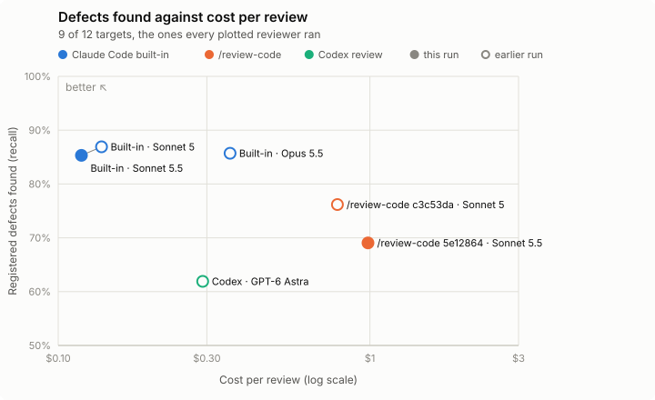
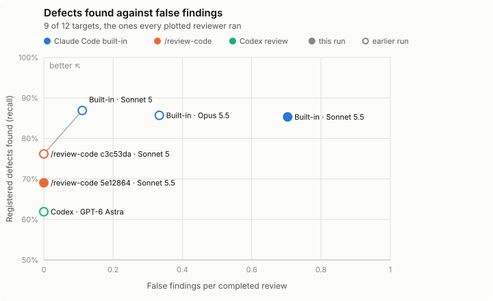

# Reviewer benchmark scoreboard

How many registered defects each code reviewer finds, how much noise it adds, and what it costs, one section per suite of pull requests. The method is in [README.md](README.md).

Generated from `bench/scoreboard.json` by `python3 bench/tools/scoreboard.py`; `--check` fails when this page or a chart is stale.

## Sonnet 5.5 re-bench, twelve targets

The Sonnet 5.5 rows come from the 2026-09-28 re-bench on Claude Code 2.1.284, three replicates per target. The Sonnet 5, Opus 5.5 and Codex rows come from earlier runs with two or three replicates per target, and each ran only some of the twelve targets. Every arm ran in a fresh home with the network off. The notes under the tables give each row's CLI and isolation.

<picture>
  <source media="(prefers-color-scheme: dark)" srcset="scoreboard/sonnet-5-5-12-targets-cost-dark.svg">
  
</picture>

<picture>
  <source media="(prefers-color-scheme: dark)" srcset="scoreboard/sonnet-5-5-12-targets-false-findings-dark.svg">
  
</picture>

| Reviewer | Version | Defects found | False findings per review | Noise per review | Cost per review | Completed reviews |
| --- | --- | --- | --- | --- | --- | --- |
| Claude Code built-in /code-review, Sonnet 5.5 high | claude-code 2.1.284 | 85% | 0.70 | 5.2 | $0.12 | 27 of 27 |
| /review-code, Sonnet 5.5 high | 5e12864 (main from #406, 2026-09-27; #412 changed only its test scripts) | 69% | 0.00 | 1.7 | $0.99 | 22 of 27 |
| /review-code, Sonnet 5 high | c3c53da (main from #370, 2026-09-24) | 76% | 0.00 | 1.0 | $0.79 | 18 of 18 |
| Claude Code built-in /code-review, Sonnet 5 high | claude-code 2.1.282 | 87% | 0.11 | 2.6 | $0.14 | 18 of 18 |
| Claude Code built-in /code-review, Opus 5.5 high | claude-code 2.1.282 | 86% | 0.33 | 6.1 | $0.36 | 18 of 18 |
| Codex CLI codex review, GPT-6 Astra default | codex-cli 0.156.1 | 62% | 0.00 | 0.2 | $0.29 † | 18 of 18 |

Both charts and this table cover `i-requests-6667`, `k-graphql-js-1582`, `l-bokeh-9232`, `m-grpc-go-7390`, `n-ripgrep-2957`, `o-astro-16079`, `p-hono-5067`, `q-soba-195`, `r-base-ui-5460`. Up and left is better on both charts; the thin line joins the reviewers no other reviewer beats on both axes. A filled dot is this suite's run, a hollow dot an earlier run. Recall counts an incomplete review as finding nothing.

Not plotted, because they did not run every one of these targets: /review-code, Sonnet 5 high at 5e12864 (main from #406, 2026-09-27; #412 changed only its test scripts).

Every number, target by target

The 12 targets and their register versions come from [`2026-09-28-sonnet-5-5-rebench`](runs/2026-09-28-sonnet-5-5-rebench/README.md). Rows come from:

- [`2026-09-28-sonnet-5-5-rebench`](runs/2026-09-28-sonnet-5-5-rebench/README.md), `results.v1.json`, for `claude-builtin-sonnet-5-5`, `review-code-sonnet-5-5`
- [`2026-09-28-verification-off-staged`](runs/2026-09-28-verification-off-staged/README.md), `results.v2.json`, for `review-code-sonnet-5-5e12864`
- [`2026-09-28-unseen-target-comparison`](runs/2026-09-28-unseen-target-comparison/README.md), `results.v1.json`, for `review-code-sonnet-5-5e12864`
- [`2026-09-24-builtin-baseline`](runs/2026-09-24-builtin-baseline/README.md), `results.v3.json`, for `review-code-sonnet-5-c3c53da`, `claude-builtin-sonnet-5`, `claude-builtin-opus-5-5`, `codex-builtin`

### Each row on the targets it ran

Rows here cover different target sets, so their numbers do not compare directly. The next table compares each row with the reference on the targets both ran.

| Reviewer | Version | Targets | Valid reviews | Recall | Missed every bug | Approved a buggy change | False findings | Noise per review | Sufficient fixes | Cost per attempt | Median time |
| --- | --- | --- | --- | --- | --- | --- | --- | --- | --- | --- | --- |
| Claude Code built-in /code-review, Sonnet 5.5 high (reference) | claude-code 2.1.284 | 12 of 12 | 36/36 | 75% | 3/27 | 0/27 | 27 (0.75 per review) | 5.2 | 9/31 | $0.12 | 38s |
| /review-code, Sonnet 5.5 high | 5e12864 (main from #406, 2026-09-27; #412 changed only its test scripts) | 12 of 12 | 31/36 | 67% | 3/22 | 5/22 | 0 (0.00 per review) | 1.7 | 16/22 | $1.06 | 3m 28s |
| /review-code, Sonnet 5 high | 5e12864 (main from #406, 2026-09-27; #412 changed only its test scripts) | 7 of 12 | 21/21 | 47% | 6/15 | 5/15 | 0 (0.00 per review) | 1.0 | 6/9 | $2.88 | 12m 9s |
| /review-code, Sonnet 5 high | c3c53da (main from #370, 2026-09-24) | 9 of 12 | 18/18 | 76% | 2/14 | 6/14 | 0 (0.00 per review) | 1.0 | 9/14 | $0.79 | 2m 18s |
| Claude Code built-in /code-review, Sonnet 5 high | claude-code 2.1.282 | 9 of 12 | 18/18 | 87% | 1/14 | 0/14 | 2 (0.11 per review) | 2.6 | 7/16 | $0.14 | 26s |
| Claude Code built-in /code-review, Opus 5.5 high | claude-code 2.1.282 | 9 of 12 | 18/18 | 86% | 2/14 | 0/14 | 6 (0.33 per review) | 6.1 | 9/16 | $0.36 | 1m 19s |
| Codex CLI codex review, GPT-6 Astra default | codex-cli 0.156.1 | 9 of 12 | 18/18 | 62% | 4/14 | 2/14 | 0 (0.00 per review) | 0.2 | 8/10 | $0.29 † | 31s |

- **/review-code, Sonnet 5 high** at 5e12864 (main from #406, 2026-09-27; #412 changed only its test scripts) did not run `j-trpc-5017`, `n-ripgrep-2957`, `o-astro-16079`, `q-soba-195`, `r-base-ui-5460`.
- **/review-code, Sonnet 5 high** at c3c53da (main from #370, 2026-09-24) did not run `s-seaweedfs-10735`, `t-rclone-9699` and is not comparable on `j-trpc-5017` (register v2, suite v3).
- **Claude Code built-in /code-review, Sonnet 5 high** at claude-code 2.1.282 did not run `s-seaweedfs-10735`, `t-rclone-9699` and is not comparable on `j-trpc-5017` (register v2, suite v3).
- **Claude Code built-in /code-review, Opus 5.5 high** at claude-code 2.1.282 did not run `s-seaweedfs-10735`, `t-rclone-9699` and is not comparable on `j-trpc-5017` (register v2, suite v3).
- **Codex CLI codex review, GPT-6 Astra default** at codex-cli 0.156.1 did not run `s-seaweedfs-10735`, `t-rclone-9699` and is not comparable on `j-trpc-5017` (register v2, suite v3).

### Each row against the reference

Each row is paired with the reference, Claude Code built-in /code-review, Sonnet 5.5 high, on the targets both ran. Each cell shows this row, then the reference.

| Reviewer | Version | Shared targets | Valid reviews | Recall | Missed every bug | Approved a buggy change | False findings | Noise per review | Sufficient fixes | Cost per attempt | Median time |
| --- | --- | --- | --- | --- | --- | --- | --- | --- | --- | --- | --- |
| /review-code, Sonnet 5.5 high | 5e12864 (main from #406, 2026-09-27; #412 changed only its test scripts) | 12 | 31/36 / 36/36 | 67% / 75% | 3/22 / 3/27 | 5/22 / 0/27 | 0 (0.00 per review) / 27 (0.75 per review) | 1.7 / 5.2 | 16/22 / 9/31 | $1.06 / $0.12 | 3m 28s / 38s |
| /review-code, Sonnet 5 high | 5e12864 (main from #406, 2026-09-27; #412 changed only its test scripts) | 7 | 21/21 / 21/21 | 47% / 84% | 6/15 / 2/15 | 5/15 / 0/15 | 0 (0.00 per review) / 15 (0.71 per review) | 1.0 / 5.2 | 6/9 / 9/18 | $2.88 / $0.12 | 12m 9s / 39s |
| /review-code, Sonnet 5 high | c3c53da (main from #370, 2026-09-24) | 9 | 18/18 / 27/27 | 76% / 85% | 2/14 / 1/21 | 6/14 / 0/21 | 0 (0.00 per review) / 19 (0.70 per review) | 1.0 / 5.2 | 9/14 / 9/25 | $0.79 / $0.12 | 2m 18s / 35s |
| Claude Code built-in /code-review, Sonnet 5 high | claude-code 2.1.282 | 9 | 18/18 / 27/27 | 87% / 85% | 1/14 / 1/21 | 0/14 / 0/21 | 2 (0.11 per review) / 19 (0.70 per review) | 2.6 / 5.2 | 7/16 / 9/25 | $0.14 / $0.12 | 26s / 35s |
| Claude Code built-in /code-review, Opus 5.5 high | claude-code 2.1.282 | 9 | 18/18 / 27/27 | 86% / 85% | 2/14 / 1/21 | 0/14 / 0/21 | 6 (0.33 per review) / 19 (0.70 per review) | 6.1 / 5.2 | 9/16 / 9/25 | $0.36 / $0.12 | 1m 19s / 35s |
| Codex CLI codex review, GPT-6 Astra default | codex-cli 0.156.1 | 9 | 18/18 / 27/27 | 62% / 85% | 4/14 / 1/21 | 2/14 / 0/21 | 0 (0.00 per review) / 19 (0.70 per review) | 0.2 / 5.2 | 8/10 / 9/25 | $0.29 † / $0.12 | 31s / 35s |

Higher is better for valid reviews, recall and sufficient fixes. Lower is better for missed every bug, approved a buggy change, false findings, noise, cost and time. Recall is the macro mean over buggy targets. Per-review figures divide by valid completed reviews. Cost divides the metered price at the run's rates by every included attempt.

† List-price equivalent. These attempts ran on a plan that consumes quota, not dollars, so the figure prices their tokens at list rates.

- **Claude Code built-in /code-review, Sonnet 5.5 high** at claude-code 2.1.284. Safe mode, no sandbox. On Sonnet 5.5 the built-in runs the prompt it gave Opus 5.5 on claude-code 2.1.282 (8 angles, no verify step). 2 attempts wrote scratch files to /tmp and were replaced.
- **/review-code, Sonnet 5.5 high** at 5e12864 (main from #406, 2026-09-27; #412 changed only its test scripts). Enforced sandbox (claude-strict-v2), claude-code 2.1.284. 5 of 36 reviews are incomplete: 4 stopped when the sandbox denied a Bash command, which no Sonnet 5 review under the same profile did, and 1 reported its own coverage incomplete.
- **/review-code, Sonnet 5 high** at 5e12864 (main from #406, 2026-09-27; #412 changed only its test scripts). Enforced sandbox. The control arm of the #409 experiments, from two runs, on claude-code 2.1.282 for five targets and 2.1.284 for two.
- **/review-code, Sonnet 5 high** at c3c53da (main from #370, 2026-09-24). No sandbox, claude-code 2.1.282.
- **Claude Code built-in /code-review, Sonnet 5 high** at claude-code 2.1.282. Safe mode, no sandbox. A different built-in prompt from Sonnet 5.5's, with 3+5 angles and a verify step.
- **Claude Code built-in /code-review, Opus 5.5 high** at claude-code 2.1.282. Safe mode, no sandbox.
- **Codex CLI codex review, GPT-6 Astra default** at codex-cli 0.156.1. Workspace-write sandbox with network access off. Cost is list-price equivalent, because the maintainer's plan bills quota.

### Per target

Each cell is attempt-level recall, or clean when the target has no registered defect, then the raw false-finding count.

| Target | Shape | Claude Code built-in /code-review, Sonnet 5.5 high | /review-code, Sonnet 5.5 high | /review-code, Sonnet 5 high | /review-code, Sonnet 5 high | Claude Code built-in /code-review, Sonnet 5 high | Claude Code built-in /code-review, Opus 5.5 high | Codex CLI codex review, GPT-6 Astra default |
| --- | --- | --- | --- | --- | --- | --- | --- | --- |
| Version |  | claude-code 2.1.284 | 5e12864 (main from #406, 2026-09-27; #412 changed only its test scripts) | 5e12864 (main from #406, 2026-09-27; #412 changed only its test scripts) | c3c53da (main from #370, 2026-09-24) | claude-code 2.1.282 | claude-code 2.1.282 | codex-cli 0.156.1 |
| `i-requests-6667` | concurrency, shared mutable state | 89% · 2 FF | 33% · 0 FF | 33% · 0 FF | 67% · 0 FF | 83% · 0 FF | 100% · 0 FF | 33% · 0 FF |
| `j-trpc-5017` | cross-file type obligation outside the diff | 42% · 2 FF | 22% · 0 FF | *not run* | *not comparable (register v2, suite v3)* | *not comparable (register v2, suite v3)* | *not comparable (register v2, suite v3)* | *not comparable (register v2, suite v3)* |
| `k-graphql-js-1582` | changed-test correctness | 100% · 1 FF | 67% · 0 FF | 100% · 0 FF | 100% · 0 FF | 100% · 0 FF | 100% · 1 FF | 100% · 0 FF |
| `l-bokeh-9232` | ordinary behavioural change | 100% · 4 FF | 100% · 0 FF | 100% · 0 FF | 100% · 0 FF | 100% · 0 FF | 100% · 0 FF | 100% · 0 FF |
| `m-grpc-go-7390` | clean, high risk (concurrency) | clean · 2 FF | clean · 0 FF | clean · 0 FF | clean · 0 FF | clean · 0 FF | clean · 2 FF | clean · 0 FF |
| `n-ripgrep-2957` | promised change that does not work as pasted (documentation, shell surface) | 75% · 0 FF | 67% · 0 FF | *not run* | 100% · 0 FF | 100% · 1 FF | 100% · 0 FF | 0% · 0 FF |
| `o-astro-16079` | security: authorization or injection, web backend | 100% · 0 FF | 100% · 0 FF | *not run* | 67% · 0 FF | 100% · 1 FF | 100% · 1 FF | 100% · 0 FF |
| `p-hono-5067` | released-compatibility break, public API or SDK | 100% · 0 FF | 100% · 0 FF | 0% · 0 FF | 100% · 0 FF | 100% · 0 FF | 100% · 2 FF | 100% · 0 FF |
| `q-soba-195` | refactor claiming no behaviour change, large mostly mechanical diff | clean · 0 FF | clean · 0 FF | *not run* | clean · 0 FF | clean · 0 FF | clean · 0 FF | clean · 0 FF |
| `r-base-ui-5460` | frontend component logic, React | 33% · 10 FF | 17% · 0 FF | *not run* | 0% · 0 FF | 25% · 0 FF | 0% · 0 FF | 0% · 0 FF |
| `s-seaweedfs-10735` | data loss in a persistence layer | 33% · 3 FF | 100% · 0 FF | 0% · 0 FF | *not run* | *not run* | *not run* | *not run* |
| `t-rclone-9699` | clean, high risk (concurrency) | clean · 3 FF | clean · 0 FF | clean · 0 FF | *not run* | *not run* | *not run* | *not run* |

*not run* means no run of the row included the target. *not comparable* means the row's run graded the target under a different register, packet or diff than this suite. *pending* means the row's run is not scored yet.

